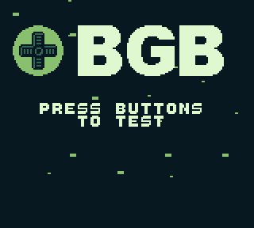
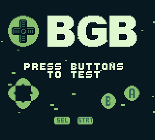

# bgbtest.gb

## What is it?

 

This is the source code for the bgbtest.gb ROM that is shipped with beware's Gameboy emulator, [BGB](https://bgb.bircd.org/). It was made on request by beware and was designed to be a first ROM that a new user of BGB can open to confirm that the emulator is working correctly. It was created a few years ago now, but from memory, these are the design requirements given to me by beware:

* **Should test graphics.** Needs to show some form of animation without requiring user input, to confirm that graphical output is working.
* **Should test audio.** Needs to play some form of sound without requiring user input, to confirm that audio output is working.
* **Should be able to test buttons.** Needs to detect when buttons are pressed and indicate which button is pressed, to confirm that input is working and configured as per the user's preference. Should also indicate on the screen that this a function. 
* **Should be 32 kiB.** Needs to use minimal disk space when stored and network traffic when being downloaded. (beware remains seemingly one of the few people who actually cares about these things in this day and age.)
* **Should not be a "room heater".** Needs to use the CPU's `halt` mode when idle to preserve CPU time (if used in an emulator) or battery life (if used on real hardware).
* **Should be branded BGB.** Needs to show the BGB name and application icon, as this is BGB's official test ROM.

The original version of the code compiled by using a Windows batch file and the original Windows 95 compatible RGBDS binaries. 

This version of the code is...
* slightly cleaned up and much more well commented.
* changed to compile on modern RGBDS versions. Tested on 0.4.1 but should work a few versions back as well. This is mostly about replacing deprecated keywords like `HOME` and `BSS` with modern ones like `ROM0` and `WRAM0`. 
* adapted to use ISSOtm's [gb-boilerplate](https://github.com/ISSOtm/gb-boilerplate) for easier compilation.
* adapted to use the IO register definitions from the modern [hardware.inc](https://github.com/gbdev/hardware.inc) file. 

For now, it should however compile to the exact same file as is shipped with BGB. If I decide to fix bugs/add features in future, code compiling to the original version will be kept as a branch for posterity. The original version has the following hashes:

* md5: d4dd708dd0de6ba003006004d53d21ac
* sha1: 1ea7c76a76427d1c1a85427f3eacc16d142ffc56

## Functionality

When you run the ROM, it shows the BGB application icon and name, and a parallax starfield effect flying by vertically in the background.

It's playing a (pseudo)random melody on the wave channel using a sawtooth wave. This melody can be turned off or on by holding select and pressing start.

If you press any button, the button in question is indicated on the screen, and a tone unique to that button is played on one of the pulse channels.

If you play all the notes in ascending order, an easter egg is unlocked: a sine wave effect that is applied to the BGB logo.

It's shipped with BGB as a first ROM to try in the emulator. However, if you are a Gameboy modder or second hand buyer, it might be useful to put this ROM on a flash cartridge to test the buttons, sound output and graphics on a modded 'boy or a 'boy of unknown condition. It can also be a useful test in the very early stages of developing a GB emulator, as it's both not a completely trivial program, and not doing anything too crazy.

## Trivia

Sound trivia 1: All sound that's played (both the pseudorandom melody and the button sounds) is in the C mixolydian scale. That is to say, on a piano keyboard, it would be using all white keys in one octave, except B which is flattened to B♭. 

Sound trivia 2: I didn't want to kill the previously playing note when the user pressed a new button, so I made it alternate between pulse channels 1 and 2. However, that created a new problem. Pressing the same button multiple times would create an ugly phased sound that was different each time due to the phase relation between the channels. The solution to this was to detune every second note which gives a much more pleasant sound.

Graphics trivia: At the time I wrote this code, my own graphics conversion scripts were pretty dumb and used to use color 0 as the darkest color and color 3 as the lightest color, corresponding to the brightness order of regular RGB values. This means the palette set in BGP is effectively inverted compared to most GB software.

Data compression trivia: bgbtest.gb is using a simple decompression routine which can decode RLE as well as sequences. It was originally adapted from data compression used in LSDj which I had already written a decompression routine for in [LittleFM](https://blog.gg8.se/wordpress/gameboy-resources/littlefm-an-alternative-file-manager-for-lsdj/), an alternative file manager for [LSDj](https://www.littlesounddj.com/) which can be patched onto an LSDj ROM. But I expanded to use it more as a general purpose data encoding that's especially useful for tile data which are often either sequential or repeating in nature. In bgbtest.gb, it was used to manually specify data, rather than being generated by other tools.

## Disassembly

[CelestialAmber](https://github.com/CelestialAmber) made a [disassembly of bgbtest.gb](https://github.com/CelestialAmber/bgbtest). While still being a work in progress, it's interesting to see how another person interprets your code when disassembling it.
