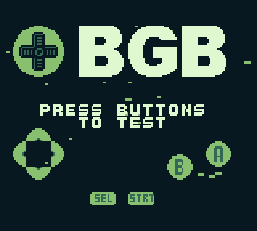
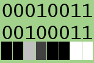

Copy of the (original blog post)[https://blog.gg8.se/wordpress/2013/01/28/gameboy-project-week-4-a-testwelcome-rom/] formatted as Markdown.

# Gameboy project week 4: A test/”welcome” ROM

This week’s was supposed to be a MIDI controllable version of Shitwave, and while that’s done, I found out it was a bit less exciting than I was hoping for, so I want to try to come up with some new ideas for that. However, I found a new project to do over the weekend. beware, the author of (BGB)[http://bgb.bircd.org/] \(Gameboy emulator and debugger\) mentioned that he wanted to include a ROM with the emulator (not specifically mentioning me) that a new user of the emulator could use to test the emulator, without having to go to a different site to find a ROM. These are his criteria for this ROM:

- Should show some form of graphics, and ideally show some form of animation.
- Should play sounds.
- Should show the user which buttons are currently pressed.

All these things are potentially useful in case the emulator (or the configuration of the emulator) is not working correctly for some reason.

For this week’s project I’m also including the source code. I pondered whether to do this or not for a couple of reasons. One reason is code vanity. When you release the source code for something, it lets other people judge the code. I would describe my programming style as casual and chaotic. This means that in a lot of cases I make things up as I go along. This means that sometimes I do things in ways that are “wrong”, or only works under certain circumstances, or are unnecessarily tedious. Another risk with releasing the source code is that people will invariably ask you for help in private communication. There’s not necessarily anything wrong with that per se (unless the question is stupid) and I try to answer questions I get in my inbox, but it may not be the most efficient way to get an answer. You may want to try my (Gameboy development forum)[https://gbdev.gg8.se/forums/] or perhaps more realistically if you want people to see your question, (NESDev’s Gameboy subforum)[https://forums.nesdev.com/viewforum.php?f=20]. Or #gbdev on EFNet if you use IRC.

## The program



The program in its current form shows the BGB icon, BGB in a big font and the text “press buttons to test”.

There’s a starfield in the background with 24 indiidual stars, made up of sprites. The stars travel from right to left and can travel at three different speeds (1, 2 or 3 pixels per frame) and there are two types of stars. Their Y positions are determined by an LFSR random number generator.

When you press one or more buttons, an indication is shown on the screen. A note is also played. I wanted to get this function right. The scale used for the notes is a mixolydian scale (or, major scale with a flat 7th) because plain major scales are boring. The note are played duophonically by alternating between the two pulse channels, so you can play two note chords. And the program also alternates between playing the actual note and playing it slightly detuned. This gives a slightly phasey sound when playing the some note multiple times, which in my opinion sounds better.

There’s also a melody played on the wave channel, which pseudorandomly generated by the same random number generator which is used for the stars. It plays notes from the same scale, **but if you want you can turn it off by pressing select+start,** say if you want to actually use this ROM for playing melodies.

The ROM also has an easter egg, which you might be able to find.

The ROM currently says BGB, but if you want, I can customize it for you to show your own logo, if you want to use it as the standard ROM to come with cartridges you sell. (The usual suspects, you know who you are.)

## Compiling

I’m using Windows (7, 64-bit) as main desktop operating system, which may come as a shock and surprise to some. And I haven’t really updated my GB development environment for a quite a few years now, simply because things have been working, and I haven’t really felt the need to. So, replace the instructions with something that fits your environment or taste, if needed. But this is my setup.

I have the following directory structure:
**c:\\gbdev\\** <- Root folder all GB dev stuff.
**c:\\gbdev\\rgbds\\** <- Here I place all the exes.
**c:\\gbdev\\rgbds\\projectname\\** <- This is of many project folders.
**c:\\gbdev\\rgbds\\inc\\** <- Here are my global include files.

For compiling the code I use RGBDS, an assembler. You can get the Windows version (here)[http://www.otakunozoku.com/rednex-gameboy-development-system/]. If you are more inclined to compile yourself, you might be better off with (bentley’s branch)[https://github.com/bentley/rgbds/]. Or, you may want to try (ASMotor)[https://github.com/asmotor/asmotor/], the “spiritual successor” to RGBDS by the same author. Some people also swear by (WLA DX)[https://www.villehelin.com/wla.html], another assembler.

In every project folder I have:
**project.asm** <- The project in question. I use the following code as a bare bones template

```
SECTION "ENTRY",HOME[$100]
        di                  ; Disable’em
        jp      ENTRY

SECTION “HEADERFILLER”,HOME[$104]
    ;; To avoid code in the header area :/
    rept    $4c
    DB    $00
    endr

SECTION “MAIN”,HOME[$150]
ENTRY
```

All allocated memory, whether in ROM (code/data) or RAM (variables) must have a section. A section can optionally have a start address, which is useful. The headerfiller section is used to fill the (header)[http://bgb.bircd.org//pandocs.htm#thecartridgeheader] with 00 bytes, since RGBFIX will take care of that later.

`m.bat` <- The equivalent of a so called "make file", but in the form of a low tech bat file. It compiles the source code into a runnable `.gb` file. and corrects the file header values. I run this from the command prompt by typing `m`. I know a `.bat` file is a bit outdated, but I never found a reason to replace my `m.bat` with a proper makefile. A makefile makes more sense for a project made in C or another higher level language, where each source file takes significant time to compile, so you want to save time by only recompiling the files you need to recompile. An asm project typically compiles in 0.01 s on my computer.

It contains the following:

```
 cls
 ..\rgbasm -oproject.obj  -i../inc/ project.asm
 ..\xlink95 -zff -mproject.map -nproject.sym project.lnk
 ..\rgbfix -pff -v -m00 -b00 -tPROJECT project.gb 
```

The first line tells the assembler to assemble project.asm and output the output into the file project.obj. The `-i` switch tells the assembler to look for files that if you use an `INCLUDE` or `INCBIN` statement, it should also look in `../inc`.

The second line tells the linker to process the files defined in `project.lnk`, see below. `-zff` tells the linker to fill unused gaps of memory in the ROM with the value `$ff`. `-mproject.map` and `-nproject.sym` tell the linker to create a map file and symbol file. The symbol file contains contains the names and addresses of the labels that you define in the source code, which a debugger like BGB can load and use to make the disassembly more readable. The `-m` switch is needed, at least for the version of the linker I’m using, because it will crash it you tell it to create a symbol file without also telling it to create a map file.

The `project.lnk` file contains the names of the object files to be linked, and the Gameboy ROM to be produced. The way I use RGBDS, I use a single main asm file where I include all the other files, which in turn produces a single object file.

```
 [output]
 project.gb

 [objects]
 project.obj
```

Finally, the rgbfix line fixes the header values (-v) extends the ROM to the next valid size, using the specified byte value (`-pff`) and sets the title (`-tPROJECT`) and MBC type and external RAM size (`-m00` and `-b00` respectively.)

In each project folder, I also keep a shortcut to `bgb.exe`, which I can drag the ROM onto to run it. (For some reason I prefer my main file association for `.gb` files to be for a hex editor rather than an emulator.)

## Some notes on the code

As mentioned above (which you probably skipped over and didn’t read) I pondered not releasing the source code to this project because of “code vanity”. I also fear that some of the things I’m doing in the code may seem obfuscated and/or not be the best educational material possible. Here are some notes of such things:

### 8 bit inc/dec for pointers

The Gameboy has three 16-bit CPU registers, `BC`, `DE` and `HL`. They can be used to perform memory operations to arbitrary addresses, such as `ld A,[DE]` which loads the contents of the memory position that DE is pointing to into the `A` (accumulator) register. The 16-bit registers are actually pairs of 8-bit registers (`B`, `C`, `D`, `E`, `H`, `L`) which can be used as such.

There is a limited set of arithmetic operations you can do on the 16-bit registers, for example `inc`, for increment. So if for example you wished to get two consecutive bytes from memory, you might do something like:

```
    ld    DE,SOMEADDRESS
    ld    A,[DE]    ; Read first byte
    inc   DE        ; Increment pointer
    ld    A,[DE]    ; Read second byte
```

However, since the 16-bit registers are actually pairs of 8-bit registers nothing stops you from doing the following:

```
    ld    DE,SOMEADDRESS
    ld    A,[DE]    ; Read first byte
    inc   E         ; Increment lower byte of pointer (dangerous)
    ld    A,[DE]    ; Read second byte
```

The `inc E` operation will be slightly faster than the `inc DE` operation because the former operates on an 8-bit register and the latter on a 16-bit register. The danger lies in what happens if `SOMEADDRESS` is right at the end of a 256 byte boundary, say if it is `$C0FF`. Instead of becoming `$C100`, the increment only works on the lower byte, and the result becomes `$C000`. However, if you take care that this will never happen, by making sure that such an increment will never go across a 256 boundary, this can be a useful optimization.


### Incrementing and decrementing pointers to access adjacent variables

A related topic. Say you have two variables defined after each other, which are related somehow. Say:

```
SECTION "VARS",BSS
VAR1    DB
VAR2    DB
```

Then say that you want to copy the value of VAR1 to VAR2. Then you can do something like

```
    ld    HL,VAR1
    ld    A,[HL+]
    ld    [HL],A
```

(`ld A,[HL+]` is a special shortcut that lets you read the value from the memory address `HL` points to, and then increment `HL`, in a single instruction. If you were to write pseudo-C representing this operation, it would be something like `A = *HL++;` This only works on the `HL` register.)

It’s all just memory, right? If you know that `VAR2` will always follow `VAR1`, you can just increment the pointer after accessing `VAR1`. If used correctly, this type of code can be efficient, (not that I’m claiming that my code is necessarily super efficient) but it’s easy to shoot yourself in the foot, especially if editing someone else’s code, so you don’t have a mental image of what the code is doing. You might for example insert a variable declaration between `VAR1` and `VAR2`, which will break any code doing this with `VAR1` and `VAR2`. In real world code you will also have branches (jumps) where you may need to ensure that a 16-bit register is pointing to the right place at a certain place in the code.

This is an example of how assembly language gives you power over C and other higher level languages that will do the dirty work for you, but maybe not in the most efficient way. With great power comes great responsibility, as the saying goes.

Enclosed in the zip file is `bgblogo-glitchfest.gb`, which is glitch-tastic example of an early development version of this ROM when I was developing the code for the starfield. I forgot to decrement or increment a pointer, which created this glitchiness.

### Lack of comments and/or useful constant values

Writing readable assembly code is 50% writing good comments. I have a bad habit of not commenting my asm code properly sometimes. This is usually ok for personal use, but could be annoying for other people. And I’m also sometimes not using constants when I really should, such as register names, or constant names that I have given to the bits corresponding to button, which could be used to test for specific buttons.

Another example is when I have an aligned table and I’m loading the high byte of the address into the high byte of a 16-bit register.

```
; Memory allocation
SECTION "OAMSOURCE",BSS[$c100]
OAMSOURCE	ds	$A0

; In some other part of the code:

; Don’t:
    ld    H,$c1

; Do:
    ld    H,OAMSOURCE>>8
```

### Learning the movements of the bits

If you want to be good at producing (efficient) assembly code for a low-bit machine, it’s crucial that you learn to visualize how individual bits constitute an integer, and how this relates to mathematical operations. For example, a shift operation also doubles as a multiplication or division by 2. An and mask where the lowest bits are set also work as a modulo operator by powers of two. (number) AND `$1F` (or `%00011111`) also works as the operation modulo 32, which can be useful.

### Converting graphics

This is a weak point in my setup. I’m still using an old retarded DOS program called `PCX2GB` for graphics conversions. It works, but just barely. Apart from the bugs in the program, it just got a little more annoying after I upgraded to 64-bit Windows, which means DOS programs no longer work natively. So now I run it in DOSBox. One of these days, I need to find a better program, but I have postponed this because I’m planning to eventually roll my own.

`PCX2GB` takes, as the name implies, a PCX image file and converts it into GB tile format. However, even though a PCX image contains exactly 4 colors, it sometimes insists on using the darkest gray as black, meaning that the tile data that it outputs only gets 3 colors. It also insists on adding empty “all black” and “all white” tiles even those tiles are not in the source data. Other than that, the program works, to some definition of works.



The bin files included in the zip is various tile data. The files marked 1b are stored in a 1 bit per pixel format. This relates to how tile data is stored in the Gameboy. Each row of 8 pixel is stored in two bytes. The first byte determines the lower bit of each pixel in that row, whereas the second byte determines the upper bit of each pixel. In the image, the leftmost bit (for example) of both these first and second byte are 0, which makes the leftmost pixel in that row get the value `00`. The rightmost pixel has the value `11` (in binary) and so on.

However, if your tile data only has two colors, say `00` and `11` (binary) the first and second byte are identical, so you can get away with only storing one of them in ROM, and writing the same value to both bytes in pair.

This is all fine, but how do you produce such source data? The `PCX2GB` does not support this tile format. In my case I just grasped for the obvious solution. I converted my tiles to a binary file as usual, and then asked the friendly snake for help. I used a Python program similar to this to select every second byte of the file and output it to a new file. (I typed the program by hand at the Python prompt and didn’t even bother to save it to a file.)

```
f = open("input.bin", "rb")
x=f.read()
f.close()
g=open("output.bin", "wb")
g.write(x[::2])
g.close()
```

The non-trivial part of that is `x[::2]` which select every second item from an array. The syntax for expression in Python is described here.

